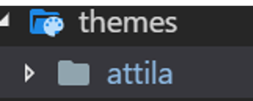

# PyFun Workshop 3

## Introduction

Websites are collection of web pages, which are documents written in mainly HyperText Markup Language(HTML).

```html
<html>
    <head>
        <title>My Site</title>
    </head>
    <body>
        <div class="main">
            <h1>Hello!</h1>
        </div>
    </body>
</html>
```

There are generally 2 types of website, static and dynamic.

Static website are site that doesn't usually change and is generally non-interactive. E.g. Personal Website.

Dynamic website are site that is interactive and change itself based on user input. E.g. Quora, Facebook.

## Requirements and Dependencies

- Python 3.7
- BeautifulSoup4
- Pelican
- Markdown

```bash
pip install beautifulsoup4 pelican markdown
```

## "Stalking" your favourite website

### Web Scraping

There can be a lot of information in a single webpage. The information is normally viewed in browser in a formatted readible way.

But what if I want to collect the information for my own use without manually going to the website via a web browser?

To do that, we can use web scraping.

### Tools for web scraping

There are many libraries/framework for web scraping

- Scrapy
- BeautifulSoup4
- MechanicalSoup

We will be using beautiful soup.

### Basic Example

Let's start with a simple [website](https://talk-93dae.firebaseapp.com/).

Going to the website, you should see something like this in the developer's view of the browser(Press F12 to access).

For safari users, go to:

```bash
Safari > Preference > Advanced > Show Development Menu in Menu bar
```

then go to:

```bash
Develop > Show Javascript Console > Elements
```

You should see something like this in the developer's view :

```html
<!DOCTYPE html>
<html>
<head>
  <meta charset="utf-8">
  <meta http-equiv="X-UA-Compatible" content="IE=edge">
  <meta name="viewport" content="width=device-width, initial-scale=1">
  <link rel="short icon" href="res/icon/16.png" type="image/x-icon">
  <link rel="manifest" href="manifest.json">
  <title>My hello world page</title>
  <link rel="stylesheet" type="text/css" href="css/index.css" media="all">
</head>

<body>
  <h1 class="vertical-container">Hello World</h1>
</body>

</html>
```

We are going to extract "Hello world" from the webpage.

To do that, let's start writing a python file by importing our needed components.

```python
from urllib.request import urlopen
from bs4 import BeautifulSoup
```

Let's start by assigning the url of the [website](https://talk-93dae.firebaseapp.com/) to a variable conveniently named "url".

```python
from urllib.request import urlopen
from bs4 import BeautifulSoup

url = "https://talk-93dae.firebaseapp.com/"

```

Now, let's open a connection to the url and read the content returned, which basically is the same thing your browser does when you go to a website.

```python
from urllib.request import urlopen
from bs4 import BeautifulSoup

url = "https://talk-93dae.firebaseapp.com/"

connection = urlopen(url) # Open a connection
html = connection.read() # Read the content
```

If you `print()` out the html you got from the url, you should see the same thing as the html in the browser you saw via the developer's console.

To briefly add to the explaination above on what is happening in the code, `urlopen(url)` opens a connection to the url, which maps to a server somewhere in the world. When the server receive our connection request, it will return us the content that we have requested, in this case the html documents. We then do `connection.read()` to read the html document that it returns to us via the connection.

We then use beautifulsoup to provide us with a better way to extract data from the html document.

```python
from urllib.request import urlopen
from bs4 import BeautifulSoup

url = "https://talk-93dae.firebaseapp.com/"

connection = urlopen(url)
html = connection.read()

page = BeautifulSoup(html, "html.parser")
```

We can then call the `find` method from the beautifulsoup object to find what we need, which in this case, would be the "hello world" content.

if you recall from above, the hello world content is written in the html in such format.

```html
<body>
  <h1 class="vertical-container">Hello World</h1>
</body>
```

So, to extract the data, simply use the `find` method specifying the tag name, which in this case is `<h1>`.

```python
from urllib.request import urlopen
from bs4 import BeautifulSoup

url = "https://talk-93dae.firebaseapp.com/"

connection = urlopen(url)
html = connection.read()

page = BeautifulSoup(html, "html.parser")

content = page.find("h1")

print(content.text)

connection.close()
```

We then print out the result, which will show "Hello World", just as what we expected.

Also remember to close the connection with `connection.close`!

### A slightly complicated example

Since we had our warmup with the simple website, let's go for a harder one. Why not use this wikipedia article for the [List of most followed instagram accounts](https://en.wikipedia.org/wiki/List_of_most-followed_Instagram_accounts)?

I would like to get the list from this table from the wikipedia page.


If we take a look at the html we will see a huge chunk of code.


The table is actually somewhere deeper inside the html, and when you find it, should look like something this.

```html
<table class="wikitable sortable">
<tbody><tr>
<th>Rank
</th>
<th class="unsortable"><abbr title="Change (within 30 days)">Chg</abbr>
</th>
<th>Country
</th>
<th>Account name
</th>
<th>Owner
</th>
<th>Followers<br />(millions)
</th>
<th>Profession
</th></tr>
... some more code
<td><a href="/wiki/Instagram" title="Instagram">Instagram</a>
</td>
<td align="center">263
</td>
<td>Social media platform
</td></tr>
<tr>
<td align="center">2
</td>
... even more code
```

So how do we extract it?

To start it of, let's just use the almost simlar code from the last example but just change the url varible's content to the new ones that we want to scrape.

```python
from urllib.request import urlopen
from bs4 import BeautifulSoup

url = "https://en.wikipedia.org/wiki/List_of_most-followed_Instagram_accounts"

connection = urlopen(url)
html = connection.read()

page = BeautifulSoup(html, "html.parser")
```

Conveniently there are only two tables in the page and the one we want is the first one, so lets use the `find` method again to get the contents.

```python
from urllib.request import urlopen
from bs4 import BeautifulSoup

url = "https://en.wikipedia.org/wiki/List_of_most-followed_Instagram_accounts"

connection = urlopen(url)
html = connection.read()

page = BeautifulSoup(html, "html.parser")

table = page.find("table")
```

If you look at the html, you will realise that the information we want is actually deeper in the table, surrounded by tags called tbody, so lets continue using the find function to obtain it.

```python
from urllib.request import urlopen
from bs4 import BeautifulSoup

url = "https://en.wikipedia.org/wiki/List_of_most-followed_Instagram_accounts"

connection = urlopen(url)
html = connection.read()

page = BeautifulSoup(html, "html.parser")

table = page.find("table")
content = table.find("tbody")
```

Each row of the table is identified using a tag called `<tr>`. So, to obtain the data on each row, let's get all the rows using the `findAll` method.

```python
from urllib.request import urlopen
from bs4 import BeautifulSoup

url = "https://en.wikipedia.org/wiki/List_of_most-followed_Instagram_accounts"

connection = urlopen(url)
html = connection.read()

page = BeautifulSoup(html, "html.parser")

table = page.find("table")
content = table.find("tbody")
data = content.findAll("tr")
```

If you `print()` data now, you should see all the rows being printed out in html format.

Now we have to extract the data into a list for us to easily read. To do that let's utilise a loop and also list comprehension.

```python
from urllib.request import urlopen
from bs4 import BeautifulSoup

url = "https://en.wikipedia.org/wiki/List_of_most-followed_Instagram_accounts"

connection = urlopen(url)
html = connection.read()

page = BeautifulSoup(html, "html.parser")

table = page.find("table")
content = table.find("tbody")
data = content.findAll("tr")
info_list = []

# Loop through all the rows
for i in range(len(data)):
    # We use list comprehension, with string replace to take off all uncessary characters.
    entry = [
        e.text.replace("\n", "").replace("\xa0", "")
         for e in data[i].findAll("td") if e.text != "\n"
    ]

    if(len(entry) != 0): #check if there is empty data, if so don't add it, otherwise add it.
        info_list.append(entry)

for s in info_list:
    print(s) #Print the data out.

connection.close()

```

What we actually did in the code is that we go through all the rows to get each columns of data of each row.

We take the data out and clean out all the unneccessary bits (Such as the "\n" character that represents new line) and save it to a list using list comprehension.

We check for any empty data before adding them into a list for our convenience. In the end we print them all out to take a look at the data we collected.

You should see something like this on the terminal:

```bash
['1', '@instagram', 'Instagram', '264', 'Social media platform', 'USA']
['2', '@cristiano', 'Cristiano Ronaldo', '146', 'Footballer', 'POR']
['3', '@selenagomez', 'Selena Gomez', '144', 'Musician and actress', 'USA']
['4', '@arianagrande', 'Ariana Grande', '134', 'Musician', 'USA']
['5', '@therock', 'Dwayne Johnson', '121', 'Actor and professional wrestler', 'USA']
...
```

Now with this knowledge, you can stalk your favourite website! Go try it out!

## Automatically generate a website

### Why waste time writing static websites in html

Enter **Static Site Generator**.

Static site generator(SSG) are programs that can generates complete websites based on a template.

SSG is useful for creating static sites that does not require much user interaction, and are mostly intended to display information that does not change frequently.

*Pelican* will be what we will be using here.

### Let's start the project!

To start:

```bash
pelican-quickstart
```

You should see something like this, just follow this configuration and it should be fine.


You should see something like this for the .


Let's look at the website. Do:

```bash
pelican --listen
```

Go to localhost:8000 and you should see a generic website.

Let's try to add a new posts into the website.

Add a `first.md` in the content folder.

```markdown
Title: first post
Date: 2018-11-19 21:00
Category: Test

Hello world from Pelican!
```

After adding the file, do:

```bash
pelican content
```

which will generate the static files for your website.

Then do:

```bash
pelican --listen
```

To start the server at localhost:8000.

There is also many option that allows you to customise more, which you can refer to from the [documentation](https://www.pelican.com/us/en/).

One of the cool customization is the theme.

To use a theme, simply download the theme from [this website](http://www.pelicanthemes.com/).

Here we will be using the [attila theme](https://github.com/arulrajnet/attila/tree/02dcad911ba1eb2d797a79ec008a810d89a2fde1). Download and extract the theme into the "themes" folder.



Then, simple add this line at the end of the `pelicanconf.py`.

```python
THEME = "./themes/attila"
```

Do `pelican --listen` and go to localhost:8000 and you should see your site with a new theme!

Feel free to experiment more with SSG and maybe create one or two static sites with it.